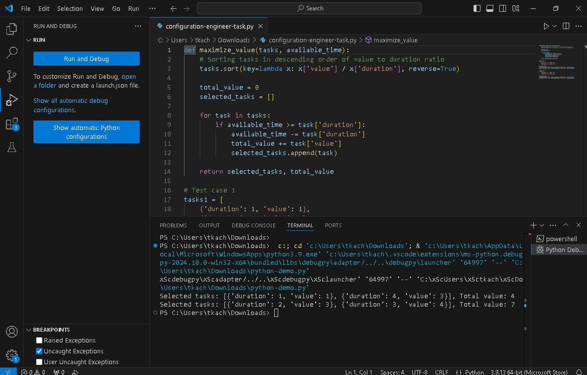

Є n задач; для кожної задані параметри:
- Трудомісткість (у годинах)
- велью від вирішення завдання (у балах)
Потрібно розробити алгоритм ранжирування задач з метою отримати максимальний велью від їх виконання за проміжок часу t (враховуємо, що якісь завдання можуть не потрапити в заданий проміжок), та показати роботу алгоритма на перевірочних кейсах.

Перевірочний кейс 1:
На інтервал 7 годин є 3 завдання:
1) тривалість 1 годину, велью 1
2) тривалість 3 години, велью 2
3) тривалість 4 години, велью 3
Алгоритм повинен вибрати задачі 2 та 3

Перевірочний кейс 2:
На інтервал 5 годин є 3 завдання:
1) тривалість 1 годину, велью 1
2) тривалість 2 години, велью 3
3) тривалість 3 години, велью 4
Алгоритм повинен вибрати задачі 2 та 3

